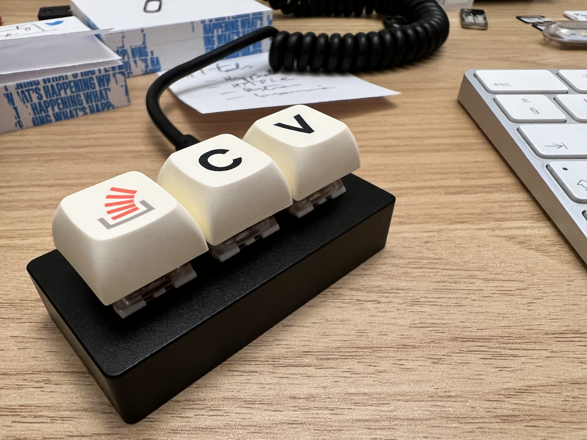
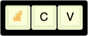

# The Key

## What is this?

Stack Overflow made an [April Fool joke](https://stackoverflow.blog/2021/03/31/the-key-copy-paste/) about a 3-key keypad just for copy/paste. And then [built one](https://drop.com/buy/stack-overflow-the-key-macropad#overview). So I had to have one.

## Links

- [Original joke](https://stackoverflow.blog/2021/03/31/the-key-copy-paste/)
- [The Key](https://drop.com/buy/stack-overflow-the-key-macropad#overview) on Drop
- [Configuring The Key](https://drop.com/talk/93641/how-to-configure-stack-overflow-the-key-macropad) on Drop

## Resources

- 📁 `firmwares` - contains `.hex` files to upload using [QMK Toolbox](https://github.com/qmk/qmk_toolbox) or CLI
- 📁 `kbfirmware` - `.json` configuration for the (deprecated) [Keyboard Firmware Builder](https://kbfirmware.com/) site
- 📁 `keyboard-layout-editor` - files from the [Keyboard Layout Editor](https://keyboard-layout-editor.com) site. The `.json` layout can be imported into the KFB site.

### TODO

- Create proper firmware for [qmk_firmware](https://github.com/qmk/qmk_firmware/) tooling and Configurator, since the `.json` files here are not compatible.

### What else?

Find [me](https://stackoverflow.com/users/262478/andy-piper) on Stack Overflow!

Send me PRs with alternative configurations? I'm still using mine as (macOS) Cmd-C-V layout, single layer. More layers! Macros! Lighting!
